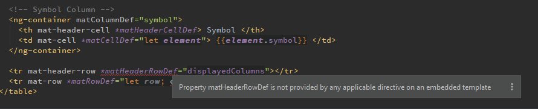

# Idea issue ng-material

IntelliJ Idea shows this error:
```
Property matHeaderRowDef is not provided by any applicable directive on an embedded template
```
for `matHeaderRowDef` in a template. This is unexpected, because `material-module.ts` exports
`MatTableModule`.  
Moreover other structural directives work: e.g. `matHeaderCellDef` does
not show any error.




related [SO IntelliJ IDEA shows error for matHeaderRowDef](https://stackoverflow.com/questions/61864468/intellij-idea-shows-error-for-matheaderrowdef)
